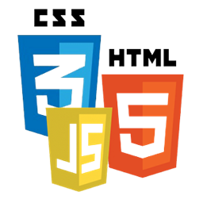
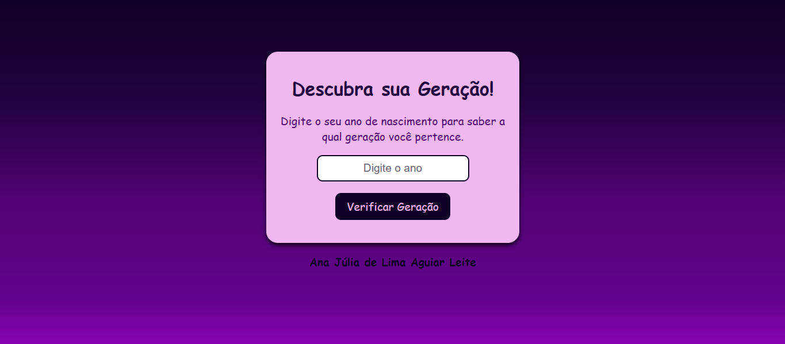

# Geração

Este é um site que você digita o ano em que nasceu, depois clica no botão <strong>verificar geração</strong> e descobre em qual grupo de geração você faz parte.

Espero que tenha gostado, divirta-se!

## Funcionalidades

- Identificação da geração pelo ano de nascimento
- Validação da entrada informada pelo usuário
- Exibição dinâmica do resultado
- Breve descrição de cada geração

## Tecnologias Utilizadas

- HTML5
- CSS3
- JavaScript

## Demonstração

## Link do projeto

## Link do Projeto

## License

